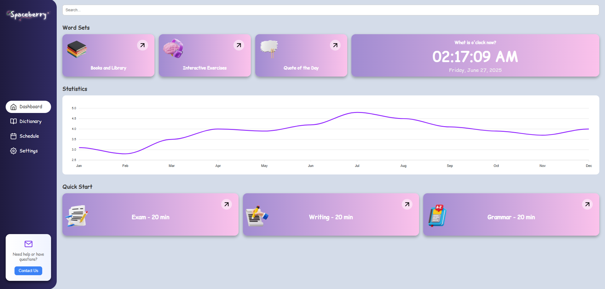

# 🚀 Spaceberry – English Learning

**Spaceberry** is a modern and interactive web-based platform for learning English, designed with a clean dashboard interface. It provides learners with tools such as vocabulary practice, grammar quizzes, writing exercises, daily quotes, and customizable schedules — all in one place.



---

## ✨ Fitur Utama

- 🔐 **Login & Register** — Autentikasi aman menggunakan Firebase Authentication
- 📚 **Books & Library** — Akses modul pembelajaran
- 🧠 **Interactive Exercises** — Kuis & latihan cepat
- 💬 **Dictionary & Translation** — Kamus + penerjemah
- ⏰ **World Clock & Quote of The Day** — Jam dunia real-time dan kutipan harian inspiratif
- 📈 **Statistik Penggunaan** — Grafik interaktif untuk melihat kunjungan
- 💻 **UI Responsif** — Tampilan optimal di perangkat desktop maupun mobile

---

## 🛠️ Tech Stack

- **HTML5, CSS3, JavaScript** — Pondasi utama antarmuka pengguna
- **Firebase Authentication & Firestore** — Untuk login dan penyimpanan progres pengguna
- **LocalStorage** — Menyimpan kunjungan, hasil quiz, dan kemajuan secara lokal
- **Fetch API** — Mengambil data dinamis dari file JSON atau API eksternal
- **ApexCharts.js** — Menampilkan statistik interaktif secara visual
- **Feather Icons** — Ikon ringan untuk navigasi dan tampilan UI
- **Cloudflare Workers** (opsional) — Digunakan sebagai proxy untuk menghindari masalah CORS saat menggunakan API translate

---

## 🔧 Cara Menjalankan

1. Clone or download the repository:
   ```bash
   git clone https://github.com/Leancyn/spaceberry.git
   cd spaceberry
   ```
2. Jalankan secara lokal dengan Live Server (VSCode)
3. Atau kunjungi versi live:
👉 https://leancyn.github.io/spaceberry/